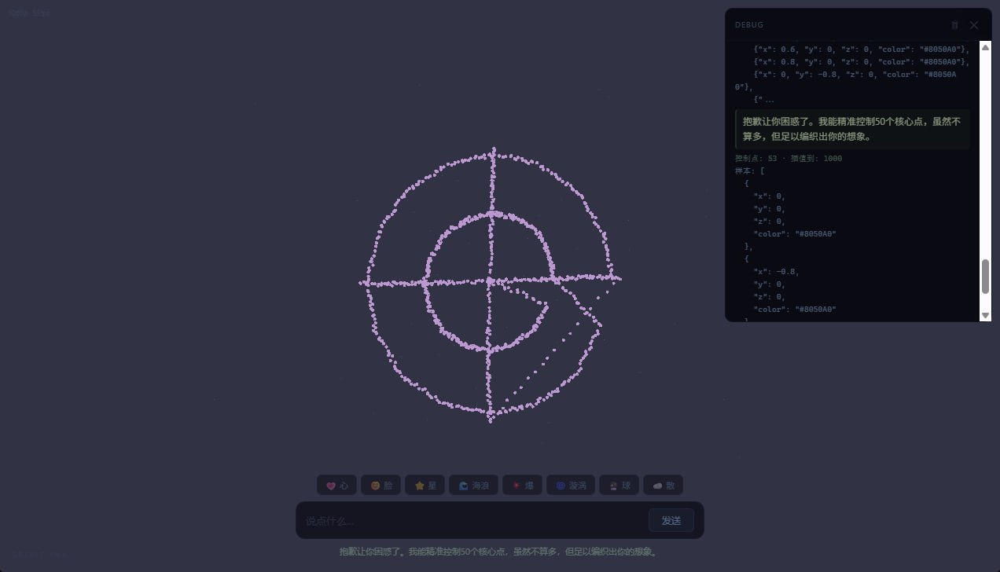

# Spirit Ink · 灵墨 🔮

[**English**](./README.md) | [**中文**](./README_CN.md)

---



**Spirit Ink** is an AI-driven token visualization engine. The AI expresses its inner state through free-form tokens, which are rendered as dynamic 3D particle formations — clouds that drift, flames that flicker, galaxies that spiral.

## ✨ Features

- **Free-form Token Expression** — AI creates tokens as free-text descriptions of its state (a word, phrase, or sentence), not predefined labels
- **35 Spatial Arrangements** — sphere, cloud, galaxy, flame, heart, dna, tornado, aurora, lotus, blackhole, and more
- **13 Continuous Movements** — drift, orbit, pulse, flicker, flow, ripple, sway, wave, and more
- **Auto Rendering Generation** — Unmapped tokens automatically trigger a second AI call to generate visual parameters
- **Spring Physics** — All parameter transitions driven by spring-damper system for organic motion
- **Multi-Pack System** — Create, switch, import, and export asset packs for different visual styles
- **Bloom Post-Processing** — UnrealBloomPass with spring-driven strength

## 🚀 Quick Start

1. Open `index.html` in a modern browser (Chrome/Edge recommended)
2. Click ⚙ (top-right) → Paste your API Key → Select model → Save
3. Type anything in the input box → Hit Enter
4. Watch particles transform into the AI's visual expression

## ⚙️ Configuration

| Setting | Description | Range |
|---------|-------------|-------|
| AI Provider | Zhipu GLM or Custom OpenAI-compatible endpoint | — |
| API Key | Your API key | — |
| Model | GLM model to use | GLM-5.1 / 5 / 5-Turbo / 4.7 / 4.6 / 4.5-Air |
| Particle Count | Number of particles in the 3D scene | 20–500 |

## 🎨 Rendering Parameters

Each token mapping defines:

| Parameter | Description | Range |
|-----------|-------------|-------|
| `arrangement` | 3D spatial pattern | 35 options (sphere, cloud, galaxy, ...) |
| `arrangement_scale` | Pattern size | 0–1 |
| `movement` | Continuous motion behavior | 13 options (drift, orbit, pulse, ...) |
| `movement_speed` | Motion speed | 0.1–2 |
| `movement_amplitude` | Motion amplitude | 0.1–1 |
| `color` | RGB color | [0–1, 0–1, 0–1] |
| `spread` | Expansion/contraction | -0.5–0.5 |
| `breathe_amp` | Breathing amplitude | 0–0.025 |
| `breathe_freq` | Breathing frequency | 0.5–2.5 Hz |
| `bloom_strength` | Glow intensity | 0–0.5 |
| `duration` | Transition time | 1000–5000 ms |
| `hold` | Maintain shape after transition | true/false |

## 🛠 Tech Stack

- **Three.js** (r170) + WebGL — particle rendering with custom ShaderMaterial
- **EffectComposer** — UnrealBloomPass + OutputPass post-processing
- **Spring Physics** — 9-parameter SpringPool driving all visual transitions
- **Zhipu GLM API** — AI token generation + rendering parameter generation
- Pure frontend, single HTML file, no build tools, no server

## 📁 Files

```
spirit-ink/
├── index.html          # Main application (v4.0)
├── providers.js        # AI provider module (Zhipu + Custom)
├── AGENTS.md           # AI agent instructions
├── DEVELOPMENT.md      # v4 design document
├── docs/
│   └── v3-new-proposal.md
├── README.md           # English docs
└── README_CN.md        # 中文文档
```

## 📜 License

MIT
